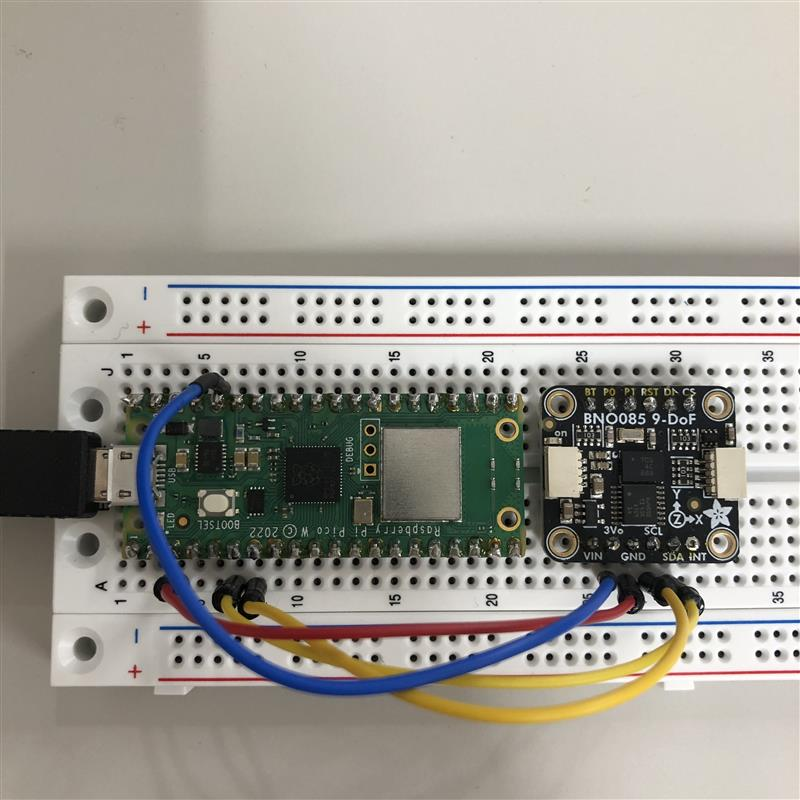

# BNO085 IMU リアルタイム3D可視化システム

BNO085 IMUセンサーからクオータニオンデータを取得し、Windows PC上でリアルタイム3Dアニメーションとして可視化するシステムです。

## 概要

- **Raspberry Pi Pico**: BNO085センサーからI2C通信でクオータニオンを読み取り、USB経由でPCに送信
- **Windows PC**: シリアルポート(COM11)からデータを受信し、3D可視化とCSVデータ記録を実行

## 機能

- ✅ リアルタイム3Dキューブアニメーション
- ✅ XYZ軸の矢印表示（赤=X/前方、緑=Y/左、青=Z/上）
- ✅ キャリブレーション機能（'r'キーで現在の姿勢を原点に設定）
- ✅ 高精度タイムスタンプ（マイクロ秒レベル、6桁精度）
- ✅ CSV自動保存（プログラム終了時にダウンロードフォルダに保存）

## ハードウェアセットアップ

### 必要な機器

- Raspberry Pi Pico（CircuitPython搭載）
- BNO085 9軸IMUセンサー
- USBケーブル（Pico ↔ PC接続用）
- ジャンパーワイヤー

### 配線

```
BNO085 → Raspberry Pi Pico
---------------------------
VCC    → 3.3V (Pin 36)
GND    → GND (Pin 38)
SCL    → GP5 (Pin 7)
SDA    → GP4 (Pin 6)
```

#### 配線写真 (BNO085-RaspberryPiPico_haisenn)



キャプション: BNO085 の VCC/GND/SCL/SDA を Raspberry Pi Pico の 3.3V/GND/GP5/GP4 に接続した例。
### CircuitPython環境構築

1. **CircuitPythonのインストール**
   - [CircuitPython公式サイト](https://circuitpython.org/board/raspberry_pi_pico/)からPico用のUF2ファイルをダウンロード
   - PicoのBOOTSELボタンを押しながらUSB接続してRPI-RP2ドライブとしてマウント
   - UF2ファイルをドライブにコピー（自動的に再起動）

2. **ライブラリのインストール**
   
   `RaspiPico-I2C/Raspi/lib/`フォルダ内のライブラリをPicoの`lib`フォルダにコピー:
   ```
   CIRCUITPY/
   └── lib/
       ├── adafruit_bno08x/
       ├── adafruit_bus_device/
       └── adafruit_register/
   ```

3. **プログラムのアップロード**
   
   `RaspiPico-I2C/Raspi/bno085_usb_send.py`を`code.py`としてPicoのルートディレクトリにコピー:
   ```
   CIRCUITPY/
   └── code.py  ← bno085_usb_send.pyをリネームしてコピー
   ```

## ソフトウェアセットアップ（Windows PC）

### 必要な環境

- Python 3.8以上
- Windows 10/11

### インストール手順

1. **仮想環境の作成**
   ```powershell
   cd C:\Users\<ユーザー名>\Local\local\BNO085
   python -m venv .venv
   ```

2. **仮想環境の有効化**
   ```powershell
   .\.venv\Scripts\Activate.ps1
   ```

3. **必要なライブラリのインストール**
   ```powershell
   pip install pyserial matplotlib numpy scipy
   ```

4. **COMポートの確認**
   
   デバイスマネージャーでRaspberry Pi PicoのCOMポート番号を確認し、必要に応じてプログラム内の`COM11`を変更してください。

## 使い方

### 1. Raspberry Pi Picoの起動

PicoをUSBでPCに接続すると、自動的に`code.py`が実行され、BNO085からのデータ送信が開始されます。

**出力フォーマット:**
```
quat_i quat_j quat_k quat_real timestamp
```

**例:**
```
-0.0410767 -0.0148315 -0.977966 0.204102 1904.42
```

### 2. Windows可視化プログラムの実行

```powershell
# 仮想環境を有効化
.\.venv\Scripts\Activate.ps1

# プログラムを実行
python RaspiPico-I2C\windows\bno085_visualize_quat.py
```

### 3. 操作方法

- **キャリブレーション**: `r`キーを押すと現在の姿勢を原点（基準姿勢）に設定
- **プログラム終了**: matplotlibウィンドウを閉じる

### 4. データの保存

プログラム終了時、自動的にダウンロードフォルダにCSVファイルが保存されます。

**ファイル名形式:**
```
YYYYMMDD_HHMMSS-Quaternion.csv
```

**例:**
```
20251210_114656-Quaternion.csv
```

**CSVフォーマット:**
```csv
Timestamp,Quat_I,Quat_J,Quat_K,Quat_Real
2025-12-10T11:46:56.144065,-0.0410767,-0.0148315,-0.977966,0.204102
2025-12-10T11:46:56.174065,-0.0410767,-0.0148315,-0.977966,0.204102
```

## データ仕様

### タイムスタンプ

- **形式**: ISO 8601形式（`YYYY-MM-DDTHH:MM:SS.ffffff`）
- **精度**: 6桁（マイクロ秒レベル、0.000001秒 = 1μs）
- **生成方法**: 
  - Windows起動時刻を基準時刻として記録
  - Picoの`time.monotonic()`で経過時間を測定
  - 基準時刻 + 経過時間 = 高精度タイムスタンプ

### クオータニオン

- **形式**: `(i, j, k, real)`
- **座標系**: 右手系（X=前方、Y=左、Z=上）
- **サンプリングレート**: 約50Hz（0.02秒間隔）

### 座標軸

- **赤色矢印**: X軸（前方）
- **緑色矢印**: Y軸（左）
- **青色矢印**: Z軸（上）

## ファイル構成

```
BNO085/
├── README.md                           # このファイル
├── RaspiPico-I2C/
│   ├── Raspi/
│   │   ├── bno085_usb_send.py         # Pico用送信プログラム（完成版）
│   │   ├── code.py                     # Pico実行中のプログラム
│   │   └── lib/                        # CircuitPythonライブラリ
│   │       ├── adafruit_bno08x/
│   │       ├── adafruit_bus_device/
│   │       └── adafruit_register/
│   └── windows/
│       ├── bno085_visualize_quat.py   # メイン可視化プログラム
│       └── bno085_receive.py          # シンプル受信テストプログラム
└── .venv/                              # Python仮想環境
```

## トラブルシューティング

### COMポートが見つからない

1. デバイスマネージャーでPicoが認識されているか確認
2. `bno085_visualize_quat.py`内の`COM11`を正しいポート番号に変更

### データが受信できない

1. Picoが正常に起動しているか確認（LEDが点滅）
2. シリアルモニタ（Thonny等）でPicoからのデータ送信を確認
3. BNO085の配線を再確認

### 3D表示がおかしい

1. `r`キーでキャリブレーションを実行
2. センサーを静止状態で再起動

### タイムスタンプが記録されない

- Picoの`bno085_usb_send.py`が最新版か確認
- 5つの値（quaternion 4つ + timestamp 1つ）が送信されているか確認

## 技術詳細

### タイムスタンプ精度

- **Pico側**: `time.monotonic()`で0.01秒（10ms）精度のタイムスタンプを送信
- **Windows側**: 
  - プログラム起動時に`datetime.now()`で基準時刻を取得
  - Picoからの経過時間と組み合わせて高精度タイムスタンプを生成
  - 最終的に6桁（マイクロ秒）精度のISO形式タイムスタンプを生成

### 座標系補正

BNO085とmatplotlib 3Dの座標系の違いを補正するため、以下の処理を実施:
- Y軸の反転
- ピッチ角の反転

これにより、センサーの物理的な動きと画面上の表示が一致します。

## 参考資料

- [Adafruit BNO08x Library](https://github.com/adafruit/Adafruit_CircuitPython_BNO08x)
- [CircuitPython Documentation](https://docs.circuitpython.org/)
- [BNO085 Datasheet](https://www.ceva-dsp.com/wp-content/uploads/2019/10/BNO080_085-Datasheet.pdf)

## ライセンス

このプロジェクトは個人利用・教育目的で自由に使用できます。

## 更新履歴

- **2025-12-10**: 初版リリース
  - リアルタイム3D可視化機能
  - 高精度タイムスタンプ（6桁）
  - CSV自動保存機能
  - キャリブレーション機能

